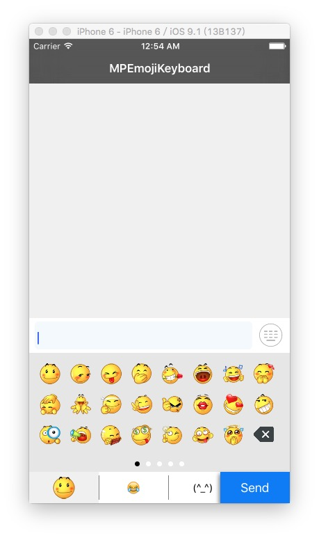

# MPEmojiKeyboard
This is a very beautiful keyboard for iOS. You can use this custom any keyboard,not only emoji keyboard.
## Screen Shot




## Quick Start
there is a demo project, you can find how to use this in MPEmojiKeyboardBuilder.m file.

```objectc

MPEmojiKeyboardAppearence *appearence = [MPEmojiKeyboardAppearence defaultAppearence];
appearence.sendKeyBackgroundColor = [UIColor colorWithARGB:0xFF107CF6];
appearence.sendKeyTextColor = [UIColor whiteColor];
appearence.sendKeyHightlightTextColor = [UIColor lightGrayColor];
appearence.groupButtonBackgroundImage = [UIImage imageFromContextWithColor:[UIColor whiteColor]];
appearence.groupButtonSelectTextColor = [UIColor blackColor];
appearence.groupButtonTextColor = [UIColor blackColor];
appearence.groupButtonSelectBackgroundImage = [UIImage imageFromContextWithColor:[UIColor colorWithARGB:0xFFF0F0F0]];

sharedKeyboard = [MPEmojiKeyboard keyboard];
sharedKeyboard.appearence = appearence;

//setup a image emoji group
MPEmojiKeyboardKeyGroup *imageEmojiGroup = [[MPEmojiKeyboardKeyGroup alloc] init];
imageEmojiGroup.keyItems = [self initImageKeyItems];
imageEmojiGroup.iconImage = [UIImage imageNamed:@"001"];

//setup a emoji group
MPEmojiKeyboardKeyGroup *test1Group = [[MPEmojiKeyboardKeyGroup alloc] init];
test1Group.keyItems = [MPEmojiKeyboardBuilder initEmojiItems];
test1Group.keyFont = [UIFont systemFontOfSize:27];
test1Group.title = @"😂";

//setup a text group layout
MPEmojiKeyboardKeysFlowLayout *textIconsLayout = [[MPEmojiKeyboardKeysFlowLayout alloc] init];
textIconsLayout.itemSize = CGSizeMake(SCREENWIDTH / 4, 142/3.0);
textIconsLayout.itemSpacing = 0;
textIconsLayout.lineSpacing = 0;
textIconsLayout.contentInsets = UIEdgeInsetsMake(0,0,0,0);

// setup a text group
MPEmojiKeyboardKeyGroup *textKeysGroup = [[MPEmojiKeyboardKeyGroup alloc] init];
textKeysGroup.keyItems = [self initTextkeyItems];
textKeysGroup.keyItemsLayout = textIconsLayout;
textKeysGroup.keyItemCellClass = [MPEmojiKeyboardTextKeyCell class];
textKeysGroup.title = @"(^_^)";

// set keybaord data source.
sharedKeyboard.keysGroups = @[imageEmojiGroup ,test1Group, textKeysGroup];
```
